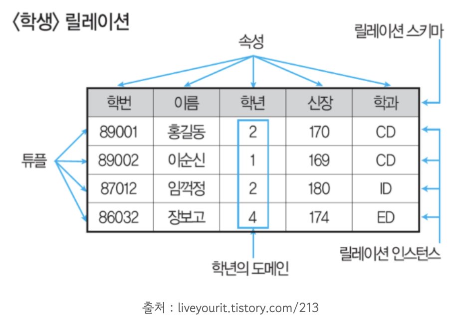
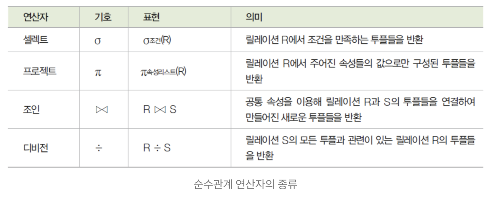
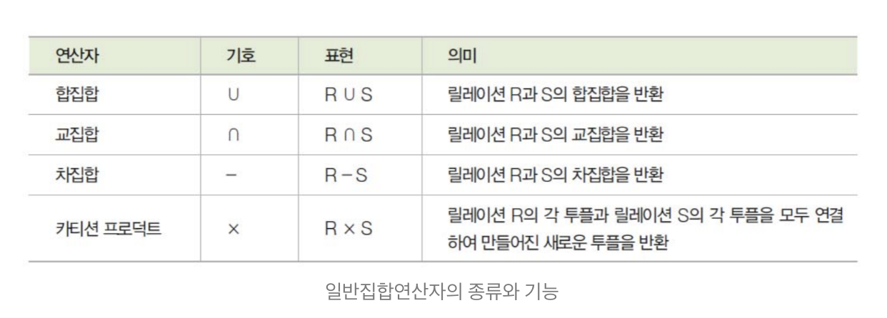

### 데이터베이스 설계

**`개념적 설계`** 정보 모델링, 개념화

- 현실 세계에 대한 인식을 추상적 개념으로 표현하는 과정
- 요구 분석 단계에서 나온 결과인 요구 조건 명세를 **`DBMS에 독립적인 E-R 다이어그램으로 작성한다.`**
- DBMS에 독립적인 개념 스키마를 설계한다.

**`논리적 설계`** 데이터 모델링

- **`특정 DBMS가 지원하는`** 논리적 자료 구조로 변환 시키는 과정
- 개념 스키마를 평가 및 정제 → DBMS에 따라 서로 다른 논리적 스키마를 설계
- **`트랜잭션의 인터페이스를 설계한다.`**

**`물리적 설계`** 데이터 구조화

- 논리적 구조로 표현된 데이터를 물리적 저장장치에 저장할 수 있는 물리적 구조의 데이터로 변환하는 과정
- 데이터베이스 파일의 저장 구조 및 액세스 경로를 결정한다.
- 데이터가 컴퓨터에 저장되는 방법을 묘사한다.
- 고려할 사항
    - 트랜잭션 처리량
    - 응답 시간
    - 디스크 용량
    - 저장 공간의 효율화

### 데이터 모델의 개념

1. 관계의 형태
    1. **`일 대 일 (1:1)`** 
        - 개체 집합 A의  각 원소가 개체 집합 B의 원소 한 개와 대응하는 관계
    2. **`일 대 다 (1:n)`** 
        - 개체 집합 A의 각 원소는 개체 집합 B의 원소 여러 개와 대응하고 있지만, 개체 집합 B의 각 원소는 집합 A의 원소 한 개와 대응하는 관계
    3. **`다 대 다 (n:n)`** 
        - 개체 집합 A의 각 원소는 개체 집합 B의 원소 여러 개와 대응, 개체 집합 B의 각 원소도 개체 집합 A의 원소 여러 개와 대응하는 관계
2. 데이터 모델에 표시할 요소
    1. 구조
        - 논리적으로 표현된 개체 타입들 간의 관계로서 데이터 구조 및 정적 성질을 표현함
    2. 연산
        - DB에 저장된 실제 데이터를 처리하는 작업에 대한 명세 → DB를 조작하는 기본 도구
    3. 제약 조건
        - DB에 저장될 수 있는 실제 데이터의 논리적인 제약 조건

### E-R (개체 - 관계) 모델

E-R 다이어 그램 

### 관계형 데이터베이스의 구조

1. 릴레이션
    - 데이터들을 표의 형태로 표현한 것, 구조를 나타내는 릴레이션 스키마와 실제 값들인 릴레이션 인스턴스로 구성
    
    
    
    1. 튜플
        - 릴레이션을 구성하는 각각의 행이다.
        - 튜플의 수 = 카디널리티 = 기수 = 대응수
    2. 속성
        - DB를 구성하는 가장 작은 논리적 단위
        - 속성의 수 = 디그리 = 차수
    3. 도메인
        - 하나의 애트리뷰트가 취할 수 있는 같은 타입의 원자값들의 집합
2. 릴레이션의 특징
    1. 한 릴레이션에 포함된 튜플들은 모두 상이하다.
    2. 한 릴레이션에 포함된 튜플 사이에는 순서가 없다.
    3. 튜플들의 삽입, 삭제 등의 작업으로 인해 릴레이션은 시간에 따라 변한다.
    4. 릴레이션 스키마를 구성하는 속성들 간의 순서는 중요하지 않다.
    5. 속성의 유일한 식별을 위해 속성의 명칭은 유일해야 한다.
    6. 속성은 더 이상 쪼갤 수 없는 원자값만을 저장한다.

### 관계형 데이터베이스의 제약 조건 - 키(Key)

1. 후보키
    1. 튜플을 유일하게 식별하기 위해 사용하는 속성들의 부분집합
    2. 릴레이션에 있는 모든 튜플에 대해서 유일성과 최소성을 만족
2. 기본키
    1. 특별히 선정된 주키로 중복된 값을 가질 수 없다.
    2. 한 릴레이션에서 특정 튜플을 유일하게 구별할 수 있는 속성
3. 대체키
    1. 후보키가 둘 이상일 때 기본키를 제외한 나머지 후보키를 의미, 보조키라고도 한다.
4. 슈퍼키
    1. 한 릴레이션 내에 있는 속성들의 집합으로 구성된 키
    2. 릴레이션을 구성하는 모든 튜플에 대해 유일성은 만족시키지만, 최소성은 만족시키지 못한다.
5. 외래키
    1. 다른 릴레이션의 기본키를 참조하는 속성 또는 속성들의 집합
    2. 한 릴레이션에 속한 속성 A와 참조 릴레이션의 기본키인 B가 동일한 도메인 상에서 정의되었을 때의 속성 A를 외래키라고 한다.

### 관계형 데이터베이스의 제약 조건 - 무결성

1. 개체 무결성
    - 기본 테이블의 기본키를 구성하는 어떤 속성도 Null 값이나 중복값을 가질 수 없다
2. 도메인 무결성
    - 주어진 속성 값이 정의된 도메인에 속한 값이어야 한다
3. 참조 무결성
    - 외래키 값은 Null 이거나 참조 릴레이션의 기본키 값과 동일해야한다.
4. 사용자 정의 무결성
    - 속성 값들이 사용자가 정의한 제약 조건에 만족해야 한다.

### 관계대수 및 관계해석

1. 관계대수의 개요
    1. 관계형 데이터베이스에서 원하는 정보와 그 정보를 어떻게 유도하는가를 기술하는 절차적인 언어
    2. 릴레이션을 처리하기 위해 연산자와 연산규칙을 제공하는 언어로 피연산자가 릴레이션이고, 결과도 릴레이션이다.
    3. 질의에 대한 해를 구하기 위해 수행해야 할 연산의 순서를 명시한다.
2. 순수 관계 연산자
    
    
    
3. 일반 집합 연산자
    
    
    

### 정규화

1. 정규화의 개요
    - 함수적 종속성 등의 종속성 이론을 이용 잘못 설계된 관계형 스키마를 더 작은 속성의 세트로 쪼개는 거
    - 하나의 종속성이 하나의 릴레이션에 표현될 수 있도록 분해해가는 과정
    - 정규화는 DB의 논리적 설계 단계에서 수행한다.
2. 정규화의 목적
    - 어떠한 릴레이션이라도 DB내에서 표현 가능하게 만든다.
    - 효과적인 검색 알고리즘을 생성할 수 있다.
    - 데이터 중복을 배제하여 이상의 발생 방지 및 자료 저장 공간의 최소화가 가능
    - 데이터 삽입 시 릴레이션을 재구성할 필요성을 줄인다.
3. 이상의 개념 및 종류
    - 정규화를 거치지 않으면 DB내에 데이터들이 불필요하게 중복되어 릴레이션 조작 시 예기치 못한 상황 발생하는 것
    - 삽입 이상 → 릴레이션에 데이터를 삽입 할 때 원하지 않은 값들도 함께 삽입
    - 삭제 이상 → 릴레이션에서 한 튜플을 삭제할때 의도와 상관없는 값들도 함께 삭제되는 연쇄 현상
    - 갱신 이상 → 릴레이션에서 튜플에 속성값을 갱신할 때 일부 튜플의 정보만 갱신되어 정보에 모순이 생기는 현상
4. 정규화 과정
    
    **`도부이결다조`**
    
    도메인이 원자값 → 부분적 함수 종속 제거 → 이행적 함수 종속 제거 → 결정자이면서 후보키가 아닌 것 제거 → 다치 종속 제거 → 조인 종속성 이용
    
5. 함수적 종속
    - 데이터들이 어떤 기준값에 의해 종속되는 것을 의미
6. 이행적 종속
    - A → B 이고 B → C 일때 A → C 를 만족하는 관계를 의미

### 반정규화

1. 반정규화의 개념
    - 시스템의 성능 향상, 개발 및 운영의 편의성 등을 위해 의도적으로 정규화 원칙을 위배하는 행위
2. 중복 테이블 추가 방법
    
    집계 테이블의 추가, 진행 테이블의 추가, 특정 부분만을 포함하는 테이블의 추가
    

### 시스템 카탈로그

- 시스템 그 자체에 관련이 있는 다양한 객체에 관한 정보를 포함하는 시스템 DB
- 좁은 의미로는 데이터 사전 DD 이라고도 한다.
- 시스템 카탈로그에 저장된 정보를 메타 데이터 라고 한다.
- 카탈로그 자체도 시스템 테이블로 구성되어 있어 일반 이용자도 SQL을 이용하여 내용을 검색해 볼 수 있다.
- INSEART , DELETE, UPDATE문으로 카탈로그를 갱신 하는 것은 허용 X